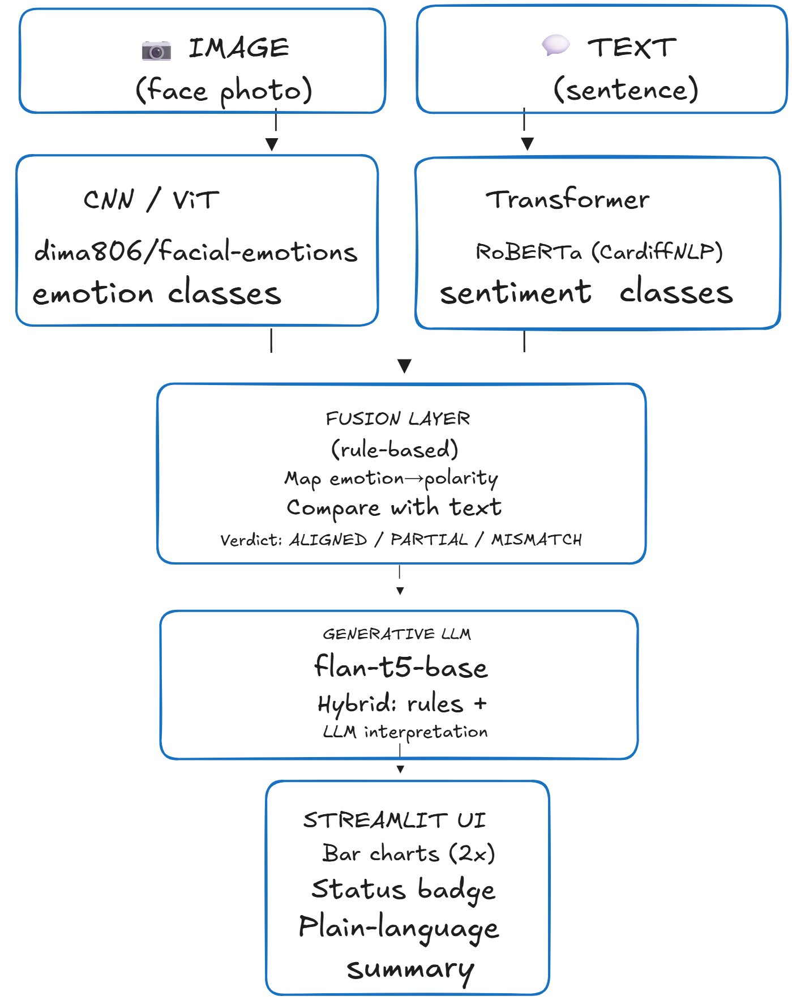
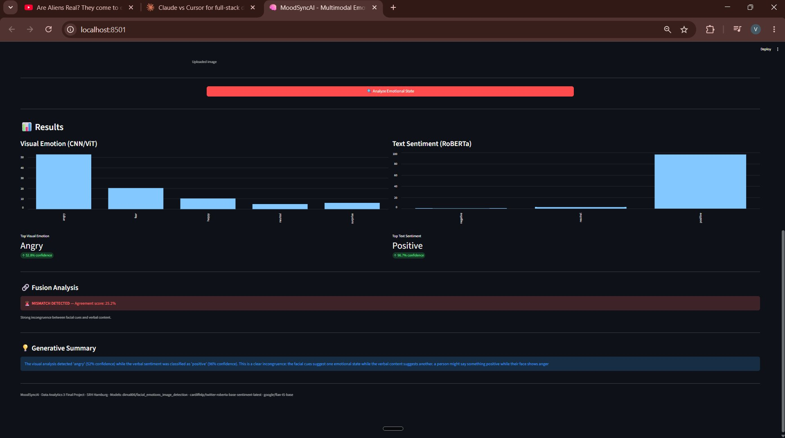
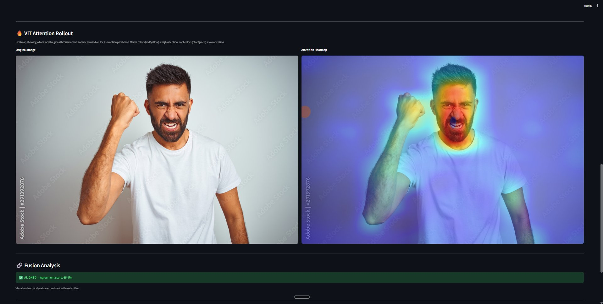

# MoodSyncAI

**Multi-Modal Sentiment & Emotion Analyser**

Data Analytics 3 (Deep Learning & GenAI) — Final Project
SRH Hamburg, Summer Semester 2025
Author: Veera Raghava Mallikarjuna Naidu Bhogadi

---

## Overview

MoodSyncAI analyses a person's emotional state by combining **two input modalities**:

1. **Visual** — a facial image, classified by a pretrained Vision Transformer (ViT)
2. **Verbal** — a typed sentence, classified by a pretrained Transformer (RoBERTa)

A **fusion layer** compares the two predictions and detects whether the visual and verbal signals are aligned or in conflict. A **generative language model** (flan-t5-base) then produces a plain-language summary explaining what the combined signals likely mean.

The system surfaces emotional incongruences — for example, when a person verbally says *"I'm fine"* but their face shows distress.

---

## Architecture



Two pretrained models run in parallel: a Vision Transformer (`dima806/facial_emotions_image_detection`) classifies the face image into one of seven emotion classes, while a RoBERTa transformer (`cardiffnlp/twitter-roberta-base-sentiment-latest`) classifies the text into a sentiment polarity. A **rule-based fusion layer** maps each visual emotion onto a sentiment polarity and compares it against the text result, emitting one of three verdicts: `ALIGNED`, `PARTIAL MISMATCH`, or `MISMATCH DETECTED`. A **generative model** (`google/flan-t5-base`) then produces a one-sentence interpretation, wrapped in a Streamlit UI that exposes the per-class probability bars, the fusion status badge, and the plain-language summary.

---

## Models used

| Component               | Model                                                     | Type                          | Size    |
|-------------------------|-----------------------------------------------------------|-------------------------------|---------|
| Visual emotion          | `dima806/facial_emotions_image_detection`                 | Vision Transformer (ViT)      | ~343 MB |
| Text sentiment          | `cardiffnlp/twitter-roberta-base-sentiment-latest`        | RoBERTa Transformer           | ~501 MB |
| Generative summary      | `google/flan-t5-base`                                     | Sequence-to-sequence T5       | ~990 MB |

All three are downloaded automatically on first run from the Hugging Face Hub. They are cached locally and reused on subsequent runs.

---

## File structure

```
moodsync-ai/
├── app.py                       # Streamlit UI (entry point)
├── cnn_emotion.py               # Facial emotion classifier (ViT)
├── text_sentiment.py            # Text sentiment classifier (RoBERTa)
├── fusion.py                    # Multimodal fusion layer (rule-based)
├── summary.py                   # Hybrid generative summary (rules + flan-t5-base)
├── attention_rollout.py         # ViT attention rollout heatmap (Extended Feature 3)
├── audio_transcribe.py          # Whisper audio transcription (Extended Feature 2)
├── README.md                    # This file
├── Documentation.pdf            # eCampus submission item 1
├── MoodSyncAI_Presentation.pdf  # eCampus submission item 3
├── MoodSyncAI_Presentation.pptx # Editable source of the presentation
├── .gitignore
└── screenshots/
    ├── architecture.png         # System architecture diagram
    ├── streamlit_demo.png       # Streamlit UI in MISMATCH state
    └── attention_rollout_demo.png # Attention heatmap example
```

---

## Installation

**Requirements:** Python 3.11+ (tested on Python 3.13.5, Windows 11)

```powershell
# 1. Clone the repo
git clone https://github.com/Bvrmnaidu/moodsync-ai.git
cd moodsync-ai

# 2. Create and activate a virtual environment
python -m venv venv
.\venv\Scripts\Activate.ps1   # PowerShell on Windows
# or: source venv/bin/activate   # macOS/Linux

# 3. Install dependencies
pip install transformers torch pillow streamlit sentencepiece accelerate
```

---

## Run

**Launch the full Streamlit app:**

```powershell
streamlit run app.py
```

The browser opens automatically at `http://localhost:8501`.

**Or run each component standalone:**

```powershell
python cnn_emotion.py        # Test the facial classifier on test_face.jpg
python text_sentiment.py     # Test the text classifier on a default sentence
python fusion.py             # Run both + fusion verdict
python summary.py            # Full pipeline + generative explanation
```

The first run will download all three models (~1.8 GB total). Subsequent runs are fast (~5–10 seconds per analysis).

---

## How fusion works

The fusion layer maps the 7 facial emotion classes to 3 sentiment polarities:

| Facial emotion        | Mapped polarity |
|-----------------------|-----------------|
| happy, surprise       | positive        |
| neutral               | neutral         |
| sad, angry, fear, disgust | negative    |

Then it compares the visual polarity with the text sentiment:

- **ALIGNED** — visual polarity matches text sentiment. Agreement score = mean of both confidences.
- **PARTIAL MISMATCH** — one modality is neutral, the other is emotionally charged. Soft warning.
- **MISMATCH DETECTED** — visual and verbal polarities directly oppose each other (e.g. negative face + positive words). The Agreement score is inverted to reflect low confidence in the unified result.

This rule-based fusion was chosen over a learned fusion network because the training data for a multimodal fusion network would have required paired image+text data with ground-truth incongruence labels — out of scope for this assignment. A learned fusion is listed as one of the optional extended features in the assignment brief.

---

## How the generative summary works

The summary is built in three sentences using a hybrid approach:

1. **Sentence 1** — rule-based factual statement of the two predictions and their confidences.
2. **Sentence 2** — rule-based statement of the fusion verdict (aligned / mismatch / partial).
3. **Sentence 3** — generated by **flan-t5-base** using a focused, single-question prompt.

This hybrid was a deliberate engineering choice. Asking flan-t5-base to produce the full 3-sentence summary from a single complex prompt resulted in the model parroting the prompt back rather than generating new content. Splitting the work — using rules for facts and the LLM only for interpretation — gives reliable, explainable output while still satisfying the generative-component requirement.

---

## Example output



**Input:**
- Image: face showing strong anger (clenched fist, intense expression)
- Text: *"No, I think the project is going really well."*

**Output:**

| Modality       | Prediction         | Confidence |
|----------------|--------------------|-----------:|
| Visual emotion | angry              | 52.8 %     |
| Text sentiment | positive           | 96.7 %     |
| Fusion status  | MISMATCH DETECTED  | —          |
| Agreement      | 25.2 %             | —          |

**Generative summary:**
> *The visual analysis detected 'angry' (52% confidence) while the verbal sentiment was classified as 'positive' (96% confidence). This is a clear incongruence: the facial cues suggest one emotional state while the verbal content suggests another. A person might say something positive while their face shows anger.*

---

## Tested scenarios

| Scenario | Visual         | Text                                               | Expected status     | Actual status       |
|----------|----------------|----------------------------------------------------|---------------------|---------------------|
| 1        | Angry          | "No, I think the project is going really well."    | MISMATCH DETECTED   | ✅ MISMATCH DETECTED |
| 2        | Happy          | "This is amazing, I love this!"                    | ALIGNED             | ✅ ALIGNED          |
| 3        | Neutral        | "The meeting is at 3 p.m."                         | ALIGNED             | ✅ ALIGNED          |

---

## Limitations and future work

- **No real-time video timeline.** The webcam captures a still frame rather than a continuous stream. Frame-by-frame emotion tracking over a speaking turn would be the natural next step.
- **Rule-based fusion.** A learned fusion network (extended feature 5 in the brief) would adapt better to ambiguous cases but requires labelled training data with ground-truth incongruence labels, which is not publicly available.
- **Generative summary quality is limited by flan-t5-base.** A larger model (e.g. flan-t5-large or an API-based GPT-class model) would produce more nuanced explanations. The hybrid template approach in this implementation guards against catastrophic failures regardless of LLM quality.
- **No cloud deployment.** The app runs locally because hosting all four models (ViT, RoBERTa, Whisper, flan-t5-base — totalling ~3 GB) requires a paid tier on most free-deployment services.

---

## Lecture mapping

Each core requirement of the assignment maps to specific lectures from the Data Analytics 3 module:

| Component                | Relevant lectures                             |
|--------------------------|-----------------------------------------------|
| Facial emotion (ViT)     | CNN; Multimodal Models                        |
| Text sentiment (RoBERTa) | RNN / LSTM; Transformers                      |
| Fusion layer             | Multimodal Models                             |
| Generative summary       | Transformers; Train your own GPT-2            |

---

## Acknowledgements

- **dima806** for the publicly released `facial_emotions_image_detection` model.
- **CardiffNLP** for the `twitter-roberta-base-sentiment-latest` model.
- **Google Research** for the **flan-t5-base** model.
- **Prof. Dr. Gayan de Silva** for course direction and the assignment brief.

---

## Extended Features Implemented

The following extended features (from section 4 of the assignment brief) are implemented:

### 1. Webcam input

Streamlit's `st.camera_input` widget allows the user to capture a still frame directly from their webcam instead of uploading a file. Implemented as a radio toggle in the visual input panel — both modes coexist without breaking the existing upload flow.

File: `app.py` (input mode toggle around line 80).

### 2. Audio input + Whisper transcription

Streamlit's `st.audio_input` records audio in the browser; OpenAI's Whisper "tiny" model transcribes the captured speech to text; the transcribed text auto-fills the text box that feeds the existing RoBERTa sentiment pipeline.

The user can also still type text manually if they prefer. The tiny variant of Whisper was chosen over `base` / `small` / `medium` / `large` to keep the model footprint small (~39 MB) and transcription latency low (~5 seconds for short clips) at the cost of some accuracy — acceptable for demo purposes.

File: `audio_transcribe.py`

### 3. ViT attention rollout heatmap



A visualisation of which facial regions the Vision Transformer attended to when predicting the emotion. Implements the **attention rollout** technique from Abnar & Zuidema (ACL 2020):

1. Forward pass with `output_attentions=True`
2. Average attention across heads, layer by layer
3. Add identity matrix to model the residual connections
4. Row-normalise so each row sums to 1
5. Iteratively multiply across all 12 transformer layers
6. Extract the CLS token's attention to the 196 image patches
7. Reshape to a 14×14 grid, upscale to the original image dimensions
8. Apply a JET colormap and blend with the original image

Note: Grad-CAM (the technique listed in the assignment brief) is designed for convolutional networks. Because the model used here is a Vision Transformer rather than a CNN, attention rollout is the correct interpretability technique for this architecture.

File: `attention_rollout.py`

---

## What was *not* implemented (and why)

- **Real-time video timeline** — out of scope for the available time; the existing webcam capture is a still frame rather than a continuous video stream.
- **Learned fusion network** — would require paired image-text data with ground-truth incongruence labels, which is not publicly available. The current rule-based fusion was the pragmatic alternative.
- **Hugging Face Spaces / Streamlit Cloud deployment** — the app runs locally because hosting all three models (CNN, RoBERTa, Whisper, flan-t5-base, totalling ~3 GB) requires a paid tier on most free-deployment services.
